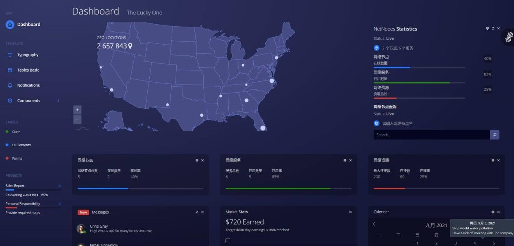

# 引论

## 介绍

### Ethereal

> **微服务框架，混合编程、注册中心、管理中心、网络监控一体化集成方案。**


### 微服务需求

> “ 庞大臃肿的业务，就像塞满逻辑的Main函数。”

  假设我们要搭建一款大型游戏，我们是不是先需要简略的分析一下系统类别：用户系统、消息系统、战斗系统、副本系统、活动系统....

  从我们的思考行为来佐证，我们也是本能的进行了业务功能需求的分离，如果把这些系统放到不同的服务器，这就叫**分布式**。

  那什么是微服务呢？分布式完成了一个系统拥有的一组功能，比如用户系统拥有：登录、注册、查询，业务逻辑那么多，其实也很麻烦，所以我们再进一步的细分，**一个微服务就是一个业务**，登录、注册、查询，就是三个微服务。

  我们从面向用户系统，转为了面向登录、注册、查询业务，颗粒度更低，目的性更强，实现起来更加轻松！

>  “提倡将单一应用程序划分成一组小的服务，服务之间互相协调、互相配合，为用户提供最终价值。”      																																			——百度百科[微服务]

  所以作者在这里做了区分：

>   *分布式：将一辆汽车分解为发动机、底盘、车身、电器；*
>
>   *微服务：将发动机、底盘、车身、电器拆分为各种零器件；*
>
>   *集群：将发动机、底盘、车身、电器乃至零器件进行批量复制。*

**发动机、底盘、车身、电器还是属于车的部件，但各种零器件已经和车没有了关联。**

大家都知道微服务的概念了，那有关微服务的一些技术问题也就接踵而来....

------

### 需求分析

#### 情景代入

1. 一家硬件研发公司，成功研发出了一款可以将脉搏信号转化为数字化信息的硬件产品；
2. 公司希望将该数据进行可视化，于是开发了一款单机客户端[C++]，供医生进行诊断分析；
3. 公司发现脉搏数据可再利用，可以通过深度学习，对该脉搏数据进行分析，可以得到一个极高准确率的诊断结果，于是公司使用C++支持的深度学习库进行数据分析，测试效果极为不错；
4. 公司发现深度学习算法放在本地并不安全，容易被恶意纂改与盗取，于是希望将算法放至服务器，所以公司采用了REST风格搭建了服务端。
5. 随着业务数量的不断增加，访问请求逻辑不断地膨胀，公司大量精力放在了请求与服务交互过程；
6. 同时公司发现数据处理工作总是绕不开Python，于是又希望将C++的服务端改为Python服务端；
7. 经过决策，公司最终决定改用支持混合编程的RPC方式，以Python作为服务端，C++作为客户端进行数据交互，将请求与服务交互交给RPC处理，自己则可以专心负责业务逻辑，同时满足了混合语言编程的需求；
8. 公司的产品好评不断，但产品只能部署在电脑端，用户反映使用显得极为不便捷，且对于报告查询、在线诊断等一系列商业化功能并未拓展，公司急需商业化的App或小程序来满足需求；
9. 公司经过分析，发现App也绕不开与Python服务端交互，但App是Java语言开发，又遇到了混合编程的难题，不过好在，团队正好选择的是混合编程RPC，框架也支持Java版本；但小程序就没有这么幸运了，小程序大多采用REST风格进行请求，但市面上并没有同时支持REST与混合编程的框架；
10. 祸不单行，随着业务数量的不断增加，服务器的数量也在不断增加，对于服务的统一管理、服务的注册与发现需求也急需解决；
11. 公司将目光看向了支持REST风格且具备注册中心、管理中心的服务框架，但市面上该类框架却只支持单一语言，意味着，如果使用该类框架，基于混合编程所搭建的服务平台，将会全面崩盘。
12. 至此，公司陷入了僵局。

### 市场分析

|    产品名    |     来源      | 开发语言 | 多种序列化 | 注册中心 | 管理中心 | 混合编程 |
| :----------: | :-----------: | :------: | :--------: | :------: | :------: | :------: |
|    Thrift    |    Apache     | 混合编程 |     ×      |    ×     |    ×     |    √     |
|     gRPC     |    Google     | 混合编程 |     ×      |    ×     |    ×     |    √     |
|    Dubbo     |    Alibaba    |   Java   |     √      |    √     |    √     |    ×     |
|    Maton     |     Weibo     |   Java   |     √      |    √     |    √     |    ×     |
| Spring Cloud |    Apache     |   Java   |     √      |    √     |    √     |    ×     |
|   Ethereal   | Ethereal Team | 混合编程 |     √      |    √     |    √     |    √     |

  通过使用Ethereal 您可以实现业务服务的快速部署，同时Ethereal除了满足上述特性外，还将具备流量监控、服务管理、容器服务的一体化建设。

### 发展规划

 通过使用Ethereal 您可以实现业务服务的快速部署，同时Ethereal除了满足上述特性外，还将具备可视化流量监控、服务管理平台，以及容器服务的建设。

 目前微服务深入至软件代码，与软件一同编译，当需要添加、修改、删除某一微服务时，需要重新打包编译，使用极其不便，仍处于高度耦合的状态。

 Ethereal在发展战略规划中，将实现服务端的容器化，微服务的插件化，微服务将通过热重载的方式注入至服务端容器，实现微服务与产品的分离。

 当企业需要开发一个额外的微服务时，只需将精力放在单一微服务的业务逻辑上，完成之后即可通过热重载的方式置入Ethereal实现服务的动态部署。

 这也意味着，微服务可以实现高度重用，解决业界相同业务代码的不断复实现的问题，例如A团队开发了一款用户系统微服务，那便可以发布至生态，供其他团队进行二次使用，这一过程的具体步骤，仅仅是：下载-配置-加载。

 Ethereal也有意将管理中心与生态相结合，用户通过管理中心，从生态获取微服务，并快速部署至对应网络节点，即使是不了解技术的甲方，一样可以通过简单的按钮点击，轻松操作与管理。

 

### 服务与请求[RPC]

  每一个微服务是一个零件，程序员通过组装零件，合成服务乃至系统，但零件和零件也会相互组合，一个微服务中，也会调用其他微服务，这样一个凌乱的环境，简化微服务调用逻辑的需求迫在眉睫！

  RPC(Remote Procedure Call)即远程方法调用，成功的解决了这个技术难点。


  图可能看起来有点复杂，其实我们可以字面意思理解，远程方法调用其实就是**调用远程服务器中的方法如同像调用本地方法一样**。

  比如得到GetName这个方法，如果请求网络服务器执行这个方法，我们需要实现具体的这个方法的数据传输、数据接收，然后得到结果，并考虑这个结果以何种方式反馈。

  如果直接通过Socket通讯，我们可以简单地通过文本操作进行数据分析。

>   请求文本："GetName||参数一||参数二||参数三..."
>
>   返回文本："GetName||结果"

  假设有100个方法，那非业务层的逻辑必然是十分臃肿与不可维护的，开发者大量时间和精力都必须投入到通讯处理。

  但如果使用RPC，开发者将不再需要关心通讯层的处理问题，可以将全部精力投入于业务逻辑开发。

```c#
//IServer接口[部署在客户端]
public interface IServer{
    public string GetName(long id);
}


//IServer实现类[部署在服务器]
public class Server:IServer{
    public string GetName(long id){
    	return NameDictionary.Get(id);//从键值表中取出名字并返回
	}
}

//使用[客户端]
public void main(){
    IServer server = RPC.Register(IServer);//向RPC注册接口
    Console.WriteLine("Name:" + server.GetName(id));
}
```

  **定义、实现、使用！**

  开发者不需要关心数据发送和反馈的各种细节，你只需在客户端定义一个接口，在服务端进行接口的对应实现，便可以在客户端进行直接调用，当采用同步方法调用时，更是保证了代码逻辑上的**顺序执行**。

  这种针对函数级别的调用，极大的简化了网络请求的复杂度，为后续微服务架构奠定了强有力的技术基础。

------


### 服务注册与发现[注册中心]

  我们既然讨论了微服务调用问题，接下来我们再进一步考虑一件事情，微服务就像各种零器件，如果只有七八个零器件，倒也简单，但一辆汽车，包含的零器件数以万计，这些零器件散落在地，凌乱混杂，怎么才能找到自己想要的那个零器件呢？

  这时候就需要一个贴心的表单了，将每一个零器件进行注册，标记坐标，当需要时我们通过表单快速查找对应零器件信息，从而确定坐标，Get。


  通过注册中心，能够将所有微服务进行注册，并通过一定的负载均衡算法，返回一个最优的目标地址。


> CAP理论
>
> 一致性(Consistency) : 所有节点在同一时间具有相同的数据
>
> 可用性(Availability) : 保证每个请求不管成功或者失败都有响应
>
> 分区容错(Partition tolerance) : 系统中任意信息的丢失或失败不会影响系统的继续运作

  我们常听的*Eurake*是AP原则，去中心化；Consul 、Zookeeper是CP原则，唯一Leader。

  Ethereal采用AP原则，去中心化处理，对于Ethereal而言，每一个Net网络节点，都是一个注册中心，所有的Net相互连接，每一个Net节点都持有其余节点的服务信息，用户可以向任意Net节点索要服务。

### 服务管理[管理中心]

  微服务其实是SOA的一种变体，所以我们可以绕回来讲讲管理中心。

  从单机而言，管理中心负责管理本机所有微服务，无关其他网络节点的微服务，单纯的开启、关闭控制自己本机的微服务，属于微服务框架中的管理模块；

  但如果管理中心的定义放大到网络上，是对所有微服务的管理，对特定微服务进行远程控制。

  在Ethereal架构中，每一个Net都是一个网络节点，网络节点下有Service服务，每一个Service服务都包含了多个微服务（函数）。

  Ethereal正积极开发网络管理中心，未来用户可以通过可视化的管理中心，对所有网络节点进行实时监控（Ethereal采用 WebSocket协议），用户可以轻松的管理每一个网络节点，并持久化在网站的实时配置。



### 特性服务[混合编程]

  作者遇到了太多需要通过混合编程来解决问题的需求了。

  例如，一个硬件开发商想要硬件产品化，采用C++客户端采集硬件数据，而核心算法的处理却又必须放在Python（算法）所架构的服务端。

  每一款语言的流行，必有其所耀眼的特点，C/C++提供了对硬件的强大编程能力，Python提供了对数据的强大处理能力，鱼和熊掌可否兼得也？

  以C++作为客户端，向Python服务端发起请求的混合编程需求，作者认为比较好的途径就是通过网络通讯协议解决，这也与RPC相吻合。

  Ethereal也对混合编程进行了支持，而且是强有力的支持，Ethereal采用了注解式声明，不需要第三方代码生成工具、不需要学习额外的语法。

  同时Ethereal也支持**任意数据类型**的传输，Ethereal采用中间抽象类型的思想，支持参数级的处理，任意参数的序列化方式与逆序列化方式，都可以进行自定义，我们可以默认采用*Json*序列化，您也可以使用ProtoBuf、Xml亦或者个人设计的序列化语法。

### 责任说明

1. Ethereal并非所有语言都会实现一套C\S，我们理性的认为，用C++搭建服务器是一个糟糕的决定，所以我们长期不会对C++的服务器版本进行支持，且短期并无意于C++客户端版本。我们深知C++客户端的迫切，所以我们采用WebSocket协议，同时也支持了HTTP协议，这两种协议无论在何种流行语言，都有完整的框架支持，所以依旧可以与Ethereal进行交互，确保了无Ethereal版本支持下的最低交互保证！
2. Ethereal热衷于支持流行语言，无论是C#、Java还是Python都有了可靠的支持，但也并非局限于这几种语言，我们仍在招募着志同道合的道友，同我们一起维护与拓展。
3. Ethereal采用LGPL开源协议，我们希望Ethereal在社区帮助下持续健康的成长，更好的为社区做贡献。
4. Ethereal长期支持，我们欢迎开发者对Ethereal进行尝鲜。