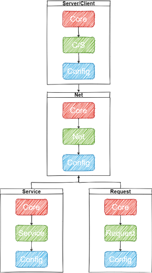
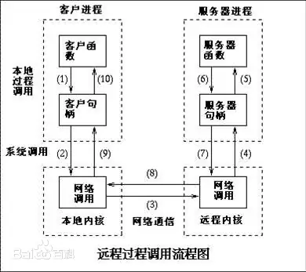

# 引论

## 介绍

### Ethereal

> **致力于解决混合编程、管理中心、注册中心、快速部署的SOA（面向服务架构）微服务框架。**



### 微服务需求

> “ 庞大臃肿的业务，就像塞满逻辑的Main函数。”

假设我们要搭建一款大型游戏，我们是不是先需要简略的分析一下系统类别：用户系统、消息系统、战斗系统、副本系统、活动系统....

从我们的思考行为来佐证，我们也是本能的进行了业务功能需求的分离，如果把这些系统放到不同的服务器，这就叫**分布式**。

那什么是微服务呢？分布式完成了一个系统拥有的一组功能，比如用户系统拥有：登录、注册、查询，业务逻辑那么多，其实也很麻烦，所以我们再进一步的细分，**一个微服务就是一个业务**，登录、注册、查询，就是三个微服务。

我们从面向用户系统，转为了面向登录、注册、查询业务，颗粒度更低，目的性更强，实现起来更加轻松！

>  “提倡将单一应用程序划分成一组小的服务，服务之间互相协调、互相配合，为用户提供最终价值。”      																																			——百度百科[微服务]

作者表示一下自己的一得之见：

>   *分布式：将一辆汽车分解为发动机、底盘、车身、电器；*
>
>   *微服务：将发动机、底盘、车身、电器拆分为各种零器件；*
>
>   *集群：将发动机、底盘、车身、电器乃至零器件进行批量复制。*

**发动机、底盘、车身、电器还是属于车的部件，但各种零器件已经和车没有了关联。**

大家都知道微服务的概念了，那有关微服务的一些技术问题也就接踵而来....

------


### 服务与请求[RPC]

每一个微服务是一个零件，程序员通过组装零件，合成服务乃至系统，但零件和零件也会相互组合，一个微服务中，也会调用其他微服务，这样一个凌乱的环境，简化微服务调用逻辑的需求迫在眉睫！

RPC(Remote Procedure Call)即远程方法调用，成功的解决了这个技术难点。



图可能看起来有点复杂，其实我们可以字面意思理解，远程方法调用其实就是**调用远程服务器中的方法如同像调用本地方法一样**。

比如得到GetName这个方法，如果请求网络服务器执行这个方法，我们需要实现具体的这个方法的数据传输、数据接收，然后得到结果，并考虑这个结果以何种方式反馈。

如果直接通过Socket通讯，我们可以简单地通过文本操作进行数据分析。

>   请求文本："GetName||参数一||参数二||参数三..."
>
>   返回文本："GetName||结果"

假设有100个方法，你要写100条这样的判断语句嘛？【作者当时真的是这么做的，打开那页的代码时，已经有些卡顿了.....】

好的，幸得贵人指点，作者去研究了RPC框架。

原理就不说了，一些动态代理和反射的知识，动态代理和反射高级语言里面都有实现，我这里重点讲一下使用方法。

```c#
//IServer接口[部署在客户端]
public interface IServer{
    public string GetName(long id);
}


//IServer实现类[部署在服务器]
public class Server:IServer{
    public string GetName(long id){
    	return NameDictionary.Get(id);//从键值表中取出名字并返回
	}
}

//使用[客户端]
public void main(){
    IServer server = RPC.Register(IServer);//向RPC注册接口
    Console.WriteLine("Name:" + server.GetName(id));
}
```

**定义、实现、使用！**

开发者不需要关心数据发送和反馈的各种细节，你只需在客户端定义一个接口，在服务端进行接口的对应实现，便可以在客户端进行直接调用，当采用同步方法调用时，更是保证了代码逻辑上的**顺序执行**。

这种针对函数级别的调用，极大的简化了网络请求的复杂度，为后续微服务架构奠定了强有力的技术基础。

------


### 服务注册与发现[注册中心]

我们既然讨论了微服务调用问题，接下来我们再进一步考虑一件事情，微服务就像各种零器件，如果只有七八个零器件，倒也简单，但一辆汽车，包含的零器件数以万计，这些零器件散落在地，凌乱混杂，怎么才能找到自己想要的那个零器件呢？

这时候就需要一个贴心的表单了，将每一个零器件进行注册，标记坐标，当需要时我们通过表单快速查找对应零器件信息，从而确定坐标，Get。


通过注册中心，能够将所有微服务进行注册，并通过一定的负载均衡算法，返回一个最优的目标地址。


> CAP理论
>
> 一致性(Consistency) : 所有节点在同一时间具有相同的数据
>
> 可用性(Availability) : 保证每个请求不管成功或者失败都有响应
>
> 分区容错(Partition tolerance) : 系统中任意信息的丢失或失败不会影响系统的继续运作

我们常听的*Eurake*是AP原则，去中心化；Consul 、Zookeeper是CP原则，唯一Leader。

Ethereal采用AP原则，去中心化处理，但Ethereal仍有意争取最大可能性的A原则，对于Ethereal的开发战略中，我们也将区块链作为了研究方向之一。

区块链的特性，可以完美的解决去中心化信息不一致的问题，但作者学业沉重，也仅仅是表态后续会尝试这一方向的进行实现（权限本就安全，极大的简化了区块链的实现难度，根据作者的分析，似乎只需要实现数据一致问题就可以了，希望这个点可以对感兴趣的人有帮助）。

### 服务管理[管理中心]

微服务其实是SOA的一种变体，所以我们可以绕回来讲讲管理中心。

从单机而言，管理中心负责管理本机所有微服务，无关其他网络节点的微服务，单纯的开启、关闭控制自己本机的微服务，属于微服务框架中的管理模块；

但如果管理中心的定义放大到网络上，是对所有微服务的管理，对特定微服务进行远程控制。

Ethereal采取网络管理中心的方案，在Ethereal架构中，每一个Net都是一个网络节点，网络节点下有Service服务，每一个Service服务都包含了多个微服务（函数）。

Ethereal正积极开发网络管理中心前端，未来用户可以通过可视化的管理中心，对所有网络节点进行实时监控（Ethereal采用 WebSocket协议），用户可以轻松的管理每一个网络节点，并持久化在网站的实时配置。


### 特性服务[混合编程]

作者遇到了太多需要通过混合编程来解决问题的需求了。

例如，一个硬件开发商想要硬件产品化，采用C++客户端采集硬件数据，而核心算法的处理却又必须放在Python（算法）所架构的服务端。

每一款语言的流行，必有其所耀眼的特点，C/C++提供了对硬件的强大编程能力，Python提供了对数据的强大处理能力，鱼和熊掌可否兼得也？

以C++作为客户端，向Python服务端发起请求的混合编程需求，作者认为比较好的途径就是通过网络通讯协议解决，这也与RPC相吻合。

Ethereal也对混合编程进行了支持，而且是强有力的支持，Ethereal采用了注解式声明，不需要第三方代码生成工具、不需要学习额外的语法。

同时Ethereal也支持**任意数据类型**的传输，Ethereal采用中间抽象类型的思想，支持参数级的处理，任意参数的序列化方式与逆序列化方式，都可以进行自定义，我们可以默认采用*Json*序列化，您也可以使用ProtoBuf、Xml亦或者个人设计的序列化语法。

### 责任说明

1. Ethereal并非所有语言都会实现一套C\S，我们理性的认为，用C++搭建服务器是一个糟糕的决定，所以我们长期不会对C++的服务器版本进行支持，且短期并无意于C++客户端版本。我们深知C++客户端的迫切，所以我们采用WebSocket协议，同时也支持了HTTP协议，这两种协议无论在何种流行语言，都有完整的框架支持，所以依旧可以与Ethereal进行交互，确保了无Ethereal版本支持下的最低交互保证！
2. Ethereal热衷于支持流行语言，无论是C#、Java还是Python都有了可靠的支持，但也并非局限于这几种语言，我们仍在招募着志同道合的道友，同我们一起维护与拓展。
3. Ethereal采用LGPL开源协议，我们希望Ethereal在社区帮助下持续健康的成长，更好的为社区做贡献。
4. Ethereal长期支持，我们欢迎开发者对Ethereal进行尝鲜。